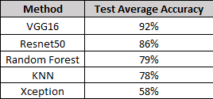
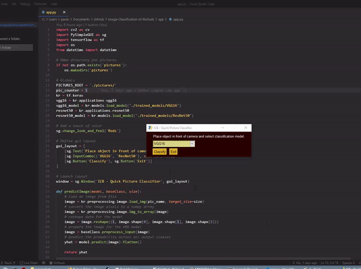

# Image-Classification-of-Biofuels-CNN
An analysis on the usefulness of various typical classification methods when applied to predicting wether images of common household processed materials classify as biomass. Classifiers used:

- VGG16
- Resnet50
- Xception
- KNN
- Random Forest

### Verdict
As predicted, when using simple traditional model fitting techniques, convolutional neural networks performed the best by a good margin.

  

  

#### Dataset and Trained Models
Large files can be found at: https://drive.google.com/open?id=1JPRsoK4WOJitXLvhHDIsXDuCVernQHh0
